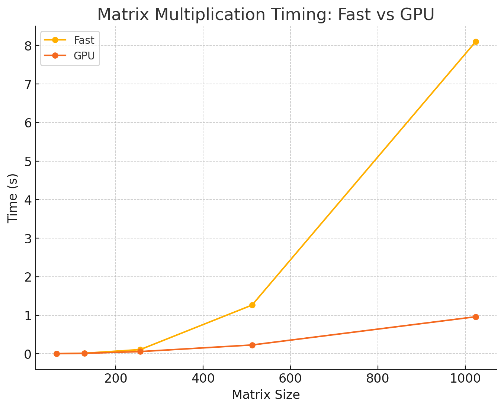

# MiniTorch Module 3


* Docs: https://minitorch.github.io/

* Overview: https://minitorch.github.io/module3.html


You will need to modify `tensor_functions.py` slightly in this assignment.

* Tests:

```
python run_tests.py
```

* Note:

Several of the tests for this assignment will only run if you are on a GPU machine and will not
run on github's test infrastructure. Please follow the instructions to setup up a colab machine
to run these tests.

This assignment requires the following files from the previous assignments. You can get these by running

```bash
python sync_previous_module.py previous-module-dir current-module-dir
```

The files that will be synced are:

        minitorch/tensor_data.py minitorch/tensor_functions.py minitorch/tensor_ops.py minitorch/operators.py minitorch/scalar.py minitorch/scalar_functions.py minitorch/module.py minitorch/autodiff.py minitorch/module.py project/run_manual.py project/run_scalar.py project/run_tensor.py minitorch/operators.py minitorch/module.py minitorch/autodiff.py minitorch/tensor.py minitorch/datasets.py minitorch/testing.py minitorch/optim.py

## Task 3.1 and 3.2: Parallel Check
```bash
MAP

================================================================================
 Parallel Accelerator Optimizing:  Function tensor_map.<locals>._map,
/content/mod3-jl3282/minitorch/fast_ops.py (164)
================================================================================


Parallel loop listing for  Function tensor_map.<locals>._map, /content/mod3-jl3282/minitorch/fast_ops.py (164)
-------------------------------------------------------------------------------------------------------------------|loop #ID
    def _map(                                                                                                      |
        out: Storage,                                                                                              |
        out_shape: Shape,                                                                                          |
        out_strides: Strides,                                                                                      |
        in_storage: Storage,                                                                                       |
        in_shape: Shape,                                                                                           |
        in_strides: Strides,                                                                                       |
    ) -> None:                                                                                                     |
        # TODO: Implement for Task 3.1.                                                                            |
        # When `out` and `in` are stride-aligned, avoid indexing                                                   |
        if list(out_shape) == list(in_shape) and list(out_strides) == list(in_strides):                            |
            for i in prange(len(out)):-----------------------------------------------------------------------------| #0
                out[i] = fn(in_storage[i])                                                                         |
            return                                                                                                 |
        else:                                                                                                      |
            for i in prange(len(out)):-----------------------------------------------------------------------------| #1
                out_index: Index = np.empty(MAX_DIMS, np.int32) # changed from int16 to int32 to avoid overflow    |
                in_index: Index = np.empty(MAX_DIMS, np.int32) # changed from int16 to int32 to avoid overflow     |
                to_index(i, out_shape, out_index)                                                                  |
                broadcast_index(out_index, out_shape, in_shape, in_index)                                          |
                o = index_to_position(out_index, out_strides)                                                      |
                j = index_to_position(in_index, in_strides)                                                        |
                out[o] = fn(in_storage[j])                                                                         |
--------------------------------- Fusing loops ---------------------------------
Attempting fusion of parallel loops (combines loops with similar properties)...
Following the attempted fusion of parallel for-loops there are 2 parallel for-
loop(s) (originating from loops labelled: #0, #1).
--------------------------------------------------------------------------------
----------------------------- Before Optimisation ------------------------------
--------------------------------------------------------------------------------
------------------------------ After Optimisation ------------------------------
Parallel structure is already optimal.
--------------------------------------------------------------------------------
--------------------------------------------------------------------------------

---------------------------Loop invariant code motion---------------------------
Allocation hoisting:
The memory allocation derived from the instruction at
/content/mod3-jl3282/minitorch/fast_ops.py (180) is hoisted out of the parallel
loop labelled #1 (it will be performed before the loop is executed and reused
inside the loop):
   Allocation:: out_index: Index = np.empty(MAX_DIMS, np.int32) # changed from
int16 to int32 to avoid overflow
    - numpy.empty() is used for the allocation.
The memory allocation derived from the instruction at
/content/mod3-jl3282/minitorch/fast_ops.py (181) is hoisted out of the parallel
loop labelled #1 (it will be performed before the loop is executed and reused
inside the loop):
   Allocation:: in_index: Index = np.empty(MAX_DIMS, np.int32) # changed from
int16 to int32 to avoid overflow
    - numpy.empty() is used for the allocation.
None
ZIP

================================================================================
 Parallel Accelerator Optimizing:  Function tensor_zip.<locals>._zip,
/content/mod3-jl3282/minitorch/fast_ops.py (214)
================================================================================


Parallel loop listing for  Function tensor_zip.<locals>._zip, /content/mod3-jl3282/minitorch/fast_ops.py (214)
-----------------------------------------------------------------------------------------------------------------------------|loop #ID
    def _zip(                                                                                                                |
        out: Storage,                                                                                                        |
        out_shape: Shape,                                                                                                    |
        out_strides: Strides,                                                                                                |
        a_storage: Storage,                                                                                                  |
        a_shape: Shape,                                                                                                      |
        a_strides: Strides,                                                                                                  |
        b_storage: Storage,                                                                                                  |
        b_shape: Shape,                                                                                                      |
        b_strides: Strides,                                                                                                  |
    ) -> None:                                                                                                               |
        # TODO: Implement for Task 3.1.                                                                                      |
        # When `out` and `in` are stride-aligned, avoid indexing                                                             |
        if list(out_shape) == list(a_shape) == list(b_shape) and list(out_strides) == list(a_strides) == list(b_strides):    |
            for i in prange(len(out)):---------------------------------------------------------------------------------------| #2
                out[i] = fn(a_storage[i], b_storage[i])                                                                      |
            return                                                                                                           |
        else:                                                                                                                |
            for i in prange(len(out)):---------------------------------------------------------------------------------------| #3
                out_index: Index = np.empty(MAX_DIMS, np.int32)                                                              |
                a_index: Index = np.empty(MAX_DIMS, np.int32)                                                                |
                b_index: Index = np.empty(MAX_DIMS, np.int32)                                                                |
                to_index(i, out_shape, out_index)                                                                            |
                o = index_to_position(out_index, out_strides)                                                                |
                broadcast_index(out_index, out_shape, a_shape, a_index)                                                      |
                j = index_to_position(a_index, a_strides)                                                                    |
                broadcast_index(out_index, out_shape, b_shape, b_index)                                                      |
                k = index_to_position(b_index, b_strides)                                                                    |
                out[o] = fn(a_storage[j], b_storage[k])                                                                      |
--------------------------------- Fusing loops ---------------------------------
Attempting fusion of parallel loops (combines loops with similar properties)...
Following the attempted fusion of parallel for-loops there are 2 parallel for-
loop(s) (originating from loops labelled: #2, #3).
--------------------------------------------------------------------------------
----------------------------- Before Optimisation ------------------------------
--------------------------------------------------------------------------------
------------------------------ After Optimisation ------------------------------
Parallel structure is already optimal.
--------------------------------------------------------------------------------
--------------------------------------------------------------------------------

---------------------------Loop invariant code motion---------------------------
Allocation hoisting:
The memory allocation derived from the instruction at
/content/mod3-jl3282/minitorch/fast_ops.py (233) is hoisted out of the parallel
loop labelled #3 (it will be performed before the loop is executed and reused
inside the loop):
   Allocation:: out_index: Index = np.empty(MAX_DIMS, np.int32)
    - numpy.empty() is used for the allocation.
The memory allocation derived from the instruction at
/content/mod3-jl3282/minitorch/fast_ops.py (234) is hoisted out of the parallel
loop labelled #3 (it will be performed before the loop is executed and reused
inside the loop):
   Allocation:: a_index: Index = np.empty(MAX_DIMS, np.int32)
    - numpy.empty() is used for the allocation.
The memory allocation derived from the instruction at
/content/mod3-jl3282/minitorch/fast_ops.py (235) is hoisted out of the parallel
loop labelled #3 (it will be performed before the loop is executed and reused
inside the loop):
   Allocation:: b_index: Index = np.empty(MAX_DIMS, np.int32)
    - numpy.empty() is used for the allocation.
None
REDUCE

================================================================================
 Parallel Accelerator Optimizing:  Function tensor_reduce.<locals>._reduce,
/content/mod3-jl3282/minitorch/fast_ops.py (268)
================================================================================


Parallel loop listing for  Function tensor_reduce.<locals>._reduce, /content/mod3-jl3282/minitorch/fast_ops.py (268)
------------------------------------------------------------------------------|loop #ID
    def _reduce(                                                              |
        out: Storage,                                                         |
        out_shape: Shape,                                                     |
        out_strides: Strides,                                                 |
        a_storage: Storage,                                                   |
        a_shape: Shape,                                                       |
        a_strides: Strides,                                                   |
        reduce_dim: int,                                                      |
    ) -> None:                                                                |
        # TODO: Implement for Task 3.1.                                       |
        reduce_size = a_shape[reduce_dim]                                     |
        reduce_stride = a_strides[reduce_dim]                                 |
                                                                              |
        for i in prange(len(out)):--------------------------------------------| #4
            out_index: Index = np.empty(MAX_DIMS, np.int32)                   |
            to_index(i, out_shape, out_index)                                 |
            o = index_to_position(out_index, out_strides) # where to write    |
            j = index_to_position(out_index, a_strides) # where to read       |
            local = out[o] # Use local variable for reduction                 |
            for _ in range(reduce_size):                                      |
                local = fn(local, a_storage[j]) # Apply reduction             |
                j += reduce_stride # Move to next element                     |
            out[o] = local                                                    |
--------------------------------- Fusing loops ---------------------------------
Attempting fusion of parallel loops (combines loops with similar properties)...
Following the attempted fusion of parallel for-loops there are 1 parallel for-
loop(s) (originating from loops labelled: #4).
--------------------------------------------------------------------------------
----------------------------- Before Optimisation ------------------------------
--------------------------------------------------------------------------------
------------------------------ After Optimisation ------------------------------
Parallel structure is already optimal.
--------------------------------------------------------------------------------
--------------------------------------------------------------------------------

---------------------------Loop invariant code motion---------------------------
Allocation hoisting:
The memory allocation derived from the instruction at
/content/mod3-jl3282/minitorch/fast_ops.py (282) is hoisted out of the parallel
loop labelled #4 (it will be performed before the loop is executed and reused
inside the loop):
   Allocation:: out_index: Index = np.empty(MAX_DIMS, np.int32)
    - numpy.empty() is used for the allocation.
None
MATRIX MULTIPLY

================================================================================
 Parallel Accelerator Optimizing:  Function _tensor_matrix_multiply,
/content/mod3-jl3282/minitorch/fast_ops.py (294)
================================================================================


Parallel loop listing for  Function _tensor_matrix_multiply, /content/mod3-jl3282/minitorch/fast_ops.py (294)
-----------------------------------------------------------------------------------------------|loop #ID
def _tensor_matrix_multiply(                                                                   |
    out: Storage,                                                                              |
    out_shape: Shape,                                                                          |
    out_strides: Strides,                                                                      |
    a_storage: Storage,                                                                        |
    a_shape: Shape,                                                                            |
    a_strides: Strides,                                                                        |
    b_storage: Storage,                                                                        |
    b_shape: Shape,                                                                            |
    b_strides: Strides,                                                                        |
) -> None:                                                                                     |
    """NUMBA tensor matrix multiply function.                                                  |
                                                                                               |
    Should work for any tensor shapes that broadcast as long as                                |
                                                                                               |
    ```                                                                                        |
    assert a_shape[-1] == b_shape[-2]                                                          |
    ```                                                                                        |
                                                                                               |
    Optimizations:                                                                             |
                                                                                               |
    * Outer loop in parallel                                                                   |
    * No index buffers or function calls                                                       |
    * Inner loop should have no global writes, 1 multiply.                                     |
                                                                                               |
                                                                                               |
    Args:                                                                                      |
    ----                                                                                       |
        out (Storage): storage for `out` tensor                                                |
        out_shape (Shape): shape for `out` tensor                                              |
        out_strides (Strides): strides for `out` tensor                                        |
        a_storage (Storage): storage for `a` tensor                                            |
        a_shape (Shape): shape for `a` tensor                                                  |
        a_strides (Strides): strides for `a` tensor                                            |
        b_storage (Storage): storage for `b` tensor                                            |
        b_shape (Shape): shape for `b` tensor                                                  |
        b_strides (Strides): strides for `b` tensor                                            |
                                                                                               |
    Returns:                                                                                   |
    -------                                                                                    |
        None : Fills in `out`                                                                  |
                                                                                               |
    """                                                                                        |
    a_batch_stride = a_strides[0] if a_shape[0] > 1 else 0                                     |
    b_batch_stride = b_strides[0] if b_shape[0] > 1 else 0                                     |
                                                                                               |
    # TODO: Implement for Task 3.2.                                                            |
    row_stride_a = a_strides[1]                                                                |
    col_stride_b = b_strides[2]                                                                |
                                                                                               |
    for n in prange(out_shape[0]): # parallel--------------------------------------------------| #5
        for i in range(out_shape[1]): # rows                                                   |
            for j in range(out_shape[2]): # cols                                               |
                o = n * out_strides[0] + i * out_strides[1] + j * out_strides[2] # position    |
                local = 0.0                                                                    |
                row_pos_a = n * a_batch_stride + i * row_stride_a                              |
                col_pos_b = n * b_batch_stride + j * col_stride_b                              |
                for _ in range(a_shape[-1]):                                                   |
                    local += a_storage[row_pos_a] * b_storage[col_pos_b]                       |
                    row_pos_a += a_strides[2]                                                  |
                    col_pos_b += b_strides[1]                                                  |
                out[o] = local                                                                 |
                                                                                               |
                                                                                               |
    # for n in prange(out_shape[0]): # parallel                                                |
    #     for i in range(out_shape[1]): # rows                                                 |
    #         for j in range(out_shape[2]): # cols                                             |
    #             out_index = np.array([n, i, j], np.int32)                                    |
    #             o = index_to_position(out_index, out_strides)                                |
    #             for k in range(a_shape[-1]):                                                 |
    #                 a_index = np.array([n, i, k], np.int32)                                  |
    #                 b_index = np.array([n, k, j], np.int32)                                  |
    #                 a = index_to_position(a_index, a_strides)                                |
    #                 b = index_to_position(b_index, b_strides)                                |
    #                 out[o] += a_storage[a] * b_storage[b]                                    |
--------------------------------- Fusing loops ---------------------------------
Attempting fusion of parallel loops (combines loops with similar properties)...
Following the attempted fusion of parallel for-loops there are 1 parallel for-
loop(s) (originating from loops labelled: #5).
--------------------------------------------------------------------------------
----------------------------- Before Optimisation ------------------------------
--------------------------------------------------------------------------------
------------------------------ After Optimisation ------------------------------
Parallel structure is already optimal.
--------------------------------------------------------------------------------
--------------------------------------------------------------------------------

---------------------------Loop invariant code motion---------------------------
Allocation hoisting:
No allocation hoisting found
None
```

## Task 3.4: Matrix Multiplication


### Timing Summary
| **Matrix Size** | **Fast (CPU) Time (s)** | **GPU Time (s)** |
|------------------|-------------------------|------------------|
| 64               | 0.00301                | 0.00581          |
| 128              | 0.01602                | 0.01260          |
| 256              | 0.11013                | 0.05844          |
| 512              | 1.26453                | 0.22964          |
| 1024             | 8.09818                | 0.96199          |

### Observations
- **Fast (CPU)** performs better for smaller matrix sizes (e.g., 64).
- **GPU** demonstrates significant speedup for larger matrix sizes (e.g., 1024).

## Task 3.5: Training
### Classification of Simple Model

**CPU:**
- `Hidden dimensions`: 100
- `Learning rate`: 0.05
- `Number of epochs`: 500
- `Average time per epoch`: 0.1583 seconds

```bash
Epoch  0  loss  6.646708659153684 correct 44
Epoch 0 took 15.3435 seconds
Epoch  10  loss  1.364562542691228 correct 46
Epoch 10 took 0.1155 seconds
Epoch  20  loss  1.9327659809597049 correct 49
Epoch 20 took 0.1180 seconds
Epoch  30  loss  0.3704921328801576 correct 50
Epoch 30 took 0.1180 seconds
Epoch  40  loss  1.1567518651337363 correct 49
Epoch 40 took 0.1160 seconds
Epoch  50  loss  0.32368927028457745 correct 50
Epoch 50 took 0.1298 seconds
Epoch  60  loss  2.208891254971478 correct 48
Epoch 60 took 0.1161 seconds
Epoch  70  loss  0.846477606190661 correct 49
Epoch 70 took 0.2092 seconds
Epoch  80  loss  0.6964668454634111 correct 50
Epoch 80 took 0.1137 seconds
Epoch  90  loss  0.05820275492589606 correct 50
Epoch 90 took 0.1177 seconds
Epoch  100  loss  0.06584990576042148 correct 49
Epoch 100 took 0.1258 seconds
Epoch  110  loss  0.4258414317371807 correct 50
Epoch 110 took 0.1146 seconds
Epoch  120  loss  0.19045814858357318 correct 49
Epoch 120 took 0.1201 seconds
Epoch  130  loss  1.0230466907055327 correct 50
Epoch 130 took 0.1119 seconds
Epoch  140  loss  0.4766253030966914 correct 50
Epoch 140 took 0.1185 seconds
Epoch  150  loss  0.18319180628422993 correct 50
Epoch 150 took 0.1155 seconds
Epoch  160  loss  1.5866765081726861 correct 49
Epoch 160 took 0.1145 seconds
Epoch  170  loss  0.275733065370518 correct 50
Epoch 170 took 0.2159 seconds
Epoch  180  loss  0.05491615849936937 correct 50
Epoch 180 took 0.1132 seconds
Epoch  190  loss  0.24050050765082884 correct 49
Epoch 190 took 0.1174 seconds
Epoch  200  loss  0.06645290684439194 correct 50
Epoch 200 took 0.1171 seconds
Epoch  210  loss  1.2901295896487852 correct 49
Epoch 210 took 0.1132 seconds
Epoch  220  loss  0.7029308343357149 correct 50
Epoch 220 took 0.1273 seconds
Epoch  230  loss  0.18477641024135158 correct 50
Epoch 230 took 0.1132 seconds
Epoch  240  loss  0.709567761118894 correct 50
Epoch 240 took 0.1174 seconds
Epoch  250  loss  0.7326171541939971 correct 50
Epoch 250 took 0.1125 seconds
Epoch  260  loss  0.01893191185057109 correct 50
Epoch 260 took 0.1456 seconds
Epoch  270  loss  0.5638107073812508 correct 50
Epoch 270 took 0.2195 seconds
Epoch  280  loss  0.4599587299482523 correct 50
Epoch 280 took 0.1142 seconds
Epoch  290  loss  0.3181536228905144 correct 50
Epoch 290 took 0.1118 seconds
Epoch  300  loss  0.022810221225600915 correct 50
Epoch 300 took 0.1089 seconds
Epoch  310  loss  0.034839859583273 correct 50
Epoch 310 took 0.1113 seconds
Epoch  320  loss  0.4360943477078122 correct 50
Epoch 320 took 0.1100 seconds
Epoch  330  loss  0.09008941341412934 correct 50
Epoch 330 took 0.1105 seconds
Epoch  340  loss  0.736615729060188 correct 49
Epoch 340 took 0.1089 seconds
Epoch  350  loss  0.5092670182893247 correct 50
Epoch 350 took 0.1122 seconds
Epoch  360  loss  0.87509330892382 correct 49
Epoch 360 took 0.1755 seconds
Epoch  370  loss  0.4959138756812618 correct 50
Epoch 370 took 0.1992 seconds
Epoch  380  loss  0.7824549156074773 correct 50
Epoch 380 took 0.1084 seconds
Epoch  390  loss  0.47715570665386287 correct 50
Epoch 390 took 0.1096 seconds
Epoch  400  loss  0.027905998726499244 correct 50
Epoch 400 took 0.1105 seconds
Epoch  410  loss  0.038566831874612406 correct 50
Epoch 410 took 0.1095 seconds
Epoch  420  loss  0.08372569597126377 correct 50
Epoch 420 took 0.1120 seconds
Epoch  430  loss  0.06393652592581409 correct 50
Epoch 430 took 0.1107 seconds
Epoch  440  loss  0.17166845998593974 correct 50
Epoch 440 took 0.1089 seconds
Epoch  450  loss  0.006150113717060897 correct 50
Epoch 450 took 0.1120 seconds
Epoch  460  loss  0.11938856563140345 correct 50
Epoch 460 took 0.1574 seconds
Epoch  470  loss  0.01775929685035969 correct 49
Epoch 470 took 0.2555 seconds
Epoch  480  loss  0.05028536294775796 correct 50
Epoch 480 took 0.1113 seconds
Epoch  490  loss  0.00031788504623694327 correct 49
Epoch 490 took 0.1149 seconds
```

**GPU**
- `Hidden dimensions`: 100
- `Learning rate`: 0.05
- `Number of epochs`: 500
- `Average time per epoch`: 1.7086 seconds

```bash
Epoch  0  loss  4.721595725519397 correct 44
Epoch 0 took 3.9942 seconds
Epoch  10  loss  2.086211993755245 correct 46
Epoch 10 took 2.0531 seconds
Epoch  20  loss  1.252509411096891 correct 47
Epoch 20 took 1.5853 seconds
Epoch  30  loss  1.0201630802346064 correct 48
Epoch 30 took 1.6086 seconds
Epoch  40  loss  0.6694032990693304 correct 49
Epoch 40 took 1.5614 seconds
Epoch  50  loss  0.5508586222429773 correct 50
Epoch 50 took 1.6872 seconds
Epoch  60  loss  0.7195476316570715 correct 48
Epoch 60 took 2.3309 seconds
Epoch  70  loss  1.8875442627869572 correct 48
Epoch 70 took 1.6125 seconds
Epoch  80  loss  0.5714553770763051 correct 48
Epoch 80 took 1.6585 seconds
Epoch  90  loss  0.5401993190575228 correct 50
Epoch 90 took 1.6225 seconds
Epoch  100  loss  0.018487434465224387 correct 48
Epoch 100 took 1.5818 seconds
Epoch  110  loss  0.013418010889371173 correct 49
Epoch 110 took 1.9910 seconds
Epoch  120  loss  0.9222376064893925 correct 48
Epoch 120 took 1.6530 seconds
Epoch  130  loss  0.34013002018975114 correct 49
Epoch 130 took 1.5933 seconds
Epoch  140  loss  0.29625218006976245 correct 50
Epoch 140 took 1.7255 seconds
Epoch  150  loss  0.2921504227656734 correct 48
Epoch 150 took 1.6464 seconds
Epoch  160  loss  0.2591793917851581 correct 49
Epoch 160 took 1.8064 seconds
Epoch  170  loss  1.1895984741505492 correct 50
Epoch 170 took 1.5189 seconds
Epoch  180  loss  0.1780106872211164 correct 48
Epoch 180 took 1.5222 seconds
Epoch  190  loss  1.2045749973463713 correct 50
Epoch 190 took 1.9161 seconds
Epoch  200  loss  0.48939138101727975 correct 49
Epoch 200 took 1.7164 seconds
Epoch  210  loss  0.31264376483340084 correct 49
Epoch 210 took 1.5325 seconds
Epoch  220  loss  0.12031453737665214 correct 48
Epoch 220 took 2.2107 seconds
Epoch  230  loss  0.22881626304896502 correct 48
Epoch 230 took 1.6570 seconds
Epoch  240  loss  0.20633533727354794 correct 49
Epoch 240 took 1.6059 seconds
Epoch  250  loss  1.2161239581182814 correct 49
Epoch 250 took 1.5879 seconds
Epoch  260  loss  0.28592179552286695 correct 49
Epoch 260 took 1.5101 seconds
Epoch  270  loss  0.8619173212810025 correct 48
Epoch 270 took 1.5842 seconds
Epoch  280  loss  0.00311018874521901 correct 50
Epoch 280 took 1.5506 seconds
Epoch  290  loss  1.0394310498445747 correct 49
Epoch 290 took 1.4999 seconds
Epoch  300  loss  0.00018271942879048426 correct 49
Epoch 300 took 1.5819 seconds
Epoch  310  loss  0.7363203752601672 correct 49
Epoch 310 took 1.5210 seconds
Epoch  320  loss  0.9092116452223122 correct 49
Epoch 320 took 1.5579 seconds
Epoch  330  loss  1.699640967234492 correct 49
Epoch 330 took 1.8153 seconds
Epoch  340  loss  0.9704988252164921 correct 49
Epoch 340 took 1.6209 seconds
Epoch  350  loss  1.0560699114172782 correct 50
Epoch 350 took 1.5583 seconds
Epoch  360  loss  0.5711220657881106 correct 50
Epoch 360 took 2.3302 seconds
Epoch  370  loss  0.8971412135941669 correct 49
Epoch 370 took 1.5811 seconds
Epoch  380  loss  0.30663545879139026 correct 50
Epoch 380 took 1.6326 seconds
Epoch  390  loss  0.1813897388133557 correct 49
Epoch 390 took 1.5900 seconds
Epoch  400  loss  1.4009151214520215 correct 48
Epoch 400 took 1.5912 seconds
Epoch  410  loss  1.7157558011919125 correct 49
Epoch 410 took 2.0381 seconds
Epoch  420  loss  0.5331010046122664 correct 50
Epoch 420 took 1.5886 seconds
Epoch  430  loss  0.6843261871376015 correct 49
Epoch 430 took 1.5675 seconds
Epoch  440  loss  0.8820016701116222 correct 50
Epoch 440 took 2.1863 seconds
Epoch  450  loss  0.004787409131820326 correct 50
Epoch 450 took 1.6046 seconds
Epoch  460  loss  0.35648471460645703 correct 49
Epoch 460 took 1.5596 seconds
Epoch  470  loss  0.1288502872849971 correct 50
Epoch 470 took 1.8073 seconds
Epoch  480  loss  0.4054820213865598 correct 50
Epoch 480 took 1.5691 seconds
Epoch  490  loss  0.0028731811841033457 correct 49
Epoch 490 took 1.6508 seconds
```


### Classification of Split Model

**CPU:**
- `Hidden dimensions`: 100
- `Learning rate`: 0.05
- `Number of epochs`: 500
- `Average time per epoch`: 0.1631 seconds

```bash
Epoch  0  loss  5.306103812716877 correct 33
Epoch 0 took 14.9024 seconds
Epoch  10  loss  5.509470402550929 correct 42
Epoch 10 took 0.1150 seconds
Epoch  20  loss  4.599778068147348 correct 45
Epoch 20 took 0.1124 seconds
Epoch  30  loss  4.852302625951175 correct 47
Epoch 30 took 0.1104 seconds
Epoch  40  loss  4.598495865731853 correct 46
Epoch 40 took 0.1104 seconds
Epoch  50  loss  2.32225473850138 correct 44
Epoch 50 took 0.1238 seconds
Epoch  60  loss  1.486759302927527 correct 48
Epoch 60 took 0.1120 seconds
Epoch  70  loss  1.3568332639817315 correct 48
Epoch 70 took 0.1131 seconds
Epoch  80  loss  1.804282843242327 correct 47
Epoch 80 took 0.1168 seconds
Epoch  90  loss  0.5053363216675787 correct 49
Epoch 90 took 0.1126 seconds
Epoch  100  loss  0.9719064049552609 correct 50
Epoch 100 took 0.2355 seconds
Epoch  110  loss  1.1202446421145054 correct 49
Epoch 110 took 0.1351 seconds
Epoch  120  loss  0.3807461568373335 correct 48
Epoch 120 took 0.1133 seconds
Epoch  130  loss  1.5206624907135908 correct 50
Epoch 130 took 0.1181 seconds
Epoch  140  loss  0.2362655664448213 correct 49
Epoch 140 took 0.1127 seconds
Epoch  150  loss  0.6998829644862703 correct 49
Epoch 150 took 0.1118 seconds
Epoch  160  loss  0.36854564021168695 correct 50
Epoch 160 took 0.1108 seconds
Epoch  170  loss  0.42675326018227366 correct 50
Epoch 170 took 0.1133 seconds
Epoch  180  loss  1.0392720205022774 correct 50
Epoch 180 took 0.1162 seconds
Epoch  190  loss  1.0414729379727334 correct 50
Epoch 190 took 0.1310 seconds
Epoch  200  loss  1.505716485490536 correct 49
Epoch 200 took 0.2558 seconds
Epoch  210  loss  2.1152807242474423 correct 49
Epoch 210 took 0.1177 seconds
Epoch  220  loss  0.2647529816692042 correct 50
Epoch 220 took 0.1148 seconds
Epoch  230  loss  1.2500500052790642 correct 49
Epoch 230 took 0.1206 seconds
Epoch  240  loss  0.24654675809944282 correct 50
Epoch 240 took 0.1139 seconds
Epoch  250  loss  1.5579375561120228 correct 50
Epoch 250 took 0.1134 seconds
Epoch  260  loss  0.6747051047916552 correct 50
Epoch 260 took 0.1138 seconds
Epoch  270  loss  0.10510129296903409 correct 50
Epoch 270 took 0.1120 seconds
Epoch  280  loss  0.23925729716351576 correct 50
Epoch 280 took 0.1185 seconds
Epoch  290  loss  0.7147912598222146 correct 50
Epoch 290 took 0.2062 seconds
Epoch  300  loss  0.9464665116030897 correct 50
Epoch 300 took 0.1138 seconds
Epoch  310  loss  0.09665410709805543 correct 50
Epoch 310 took 0.1170 seconds
Epoch  320  loss  0.4676975320918997 correct 50
Epoch 320 took 0.1198 seconds
Epoch  330  loss  0.847344368791927 correct 50
Epoch 330 took 0.1161 seconds
Epoch  340  loss  0.01928574153319925 correct 50
Epoch 340 took 0.1153 seconds
Epoch  350  loss  0.13835730676972935 correct 50
Epoch 350 took 0.1216 seconds
Epoch  360  loss  0.6561917164295673 correct 50
Epoch 360 took 0.1142 seconds
Epoch  370  loss  0.5251769062227697 correct 50
Epoch 370 took 0.1208 seconds
Epoch  380  loss  0.21655340985851806 correct 50
Epoch 380 took 0.2225 seconds
Epoch  390  loss  0.1646190773088254 correct 50
Epoch 390 took 0.2720 seconds
Epoch  400  loss  0.5051444767260053 correct 50
Epoch 400 took 0.1174 seconds
Epoch  410  loss  0.3933905285653424 correct 50
Epoch 410 took 0.1147 seconds
Epoch  420  loss  0.1662468848604156 correct 50
Epoch 420 took 0.1162 seconds
Epoch  430  loss  0.5391234780235814 correct 50
Epoch 430 took 0.1168 seconds
Epoch  440  loss  0.3233666991579571 correct 50
Epoch 440 took 0.1200 seconds
Epoch  450  loss  0.5037486242308881 correct 50
Epoch 450 took 0.1296 seconds
Epoch  460  loss  0.25447943266460266 correct 50
Epoch 460 took 0.1205 seconds
Epoch  470  loss  0.4951114893410279 correct 50
Epoch 470 took 0.1157 seconds
Epoch  480  loss  0.03033908445948318 correct 50
Epoch 480 took 0.1928 seconds
Epoch  490  loss  0.06762694987820907 correct 50
Epoch 490 took 0.2695 seconds
```

**GPU:**
- `Hidden dimensions`: 100
- `Learning rate`: 0.05
- `Number of epochs`: 500
- `Average time per epoch`: 1.7059 seconds

```bash
Epoch  0  loss  7.492816250685866 correct 35
Epoch 0 took 3.9564 seconds
Epoch  10  loss  4.904244834754931 correct 40
Epoch 10 took 1.5398 seconds
Epoch  20  loss  3.966083524590363 correct 40
Epoch 20 took 1.5243 seconds
Epoch  30  loss  5.478925670071428 correct 40
Epoch 30 took 1.5848 seconds
Epoch  40  loss  4.942133447463281 correct 45
Epoch 40 took 1.5506 seconds
Epoch  50  loss  4.826267341060767 correct 42
Epoch 50 took 1.6013 seconds
Epoch  60  loss  2.379397971787037 correct 44
Epoch 60 took 1.5210 seconds
Epoch  70  loss  2.64501288824106 correct 47
Epoch 70 took 1.7316 seconds
Epoch  80  loss  3.4892148194790304 correct 48
Epoch 80 took 1.5891 seconds
Epoch  90  loss  3.0146028423865374 correct 48
Epoch 90 took 1.5412 seconds
Epoch  100  loss  2.479498994694072 correct 49
Epoch 100 took 1.7382 seconds
Epoch  110  loss  2.2366523539738896 correct 47
Epoch 110 took 1.5881 seconds
Epoch  120  loss  0.9449144305429988 correct 48
Epoch 120 took 1.6085 seconds
Epoch  130  loss  1.889338245464036 correct 49
Epoch 130 took 1.8906 seconds
Epoch  140  loss  1.266883875919085 correct 48
Epoch 140 took 1.5700 seconds
Epoch  150  loss  1.2060489613826746 correct 48
Epoch 150 took 1.5994 seconds
Epoch  160  loss  1.1535555364385885 correct 49
Epoch 160 took 2.1434 seconds
Epoch  170  loss  1.3318290191603066 correct 48
Epoch 170 took 1.5935 seconds
Epoch  180  loss  0.44697931721031786 correct 48
Epoch 180 took 1.6233 seconds
Epoch  190  loss  0.8397809033343604 correct 49
Epoch 190 took 1.6824 seconds
Epoch  200  loss  0.5758715369993194 correct 50
Epoch 200 took 1.5692 seconds
Epoch  210  loss  1.4075219708196645 correct 48
Epoch 210 took 2.2907 seconds
Epoch  220  loss  0.48714756545721566 correct 50
Epoch 220 took 1.6041 seconds
Epoch  230  loss  1.5977301160470394 correct 49
Epoch 230 took 1.5970 seconds
Epoch  240  loss  0.28249543828500523 correct 49
Epoch 240 took 2.1071 seconds
Epoch  250  loss  1.1981047195625572 correct 50
Epoch 250 took 1.5242 seconds
Epoch  260  loss  0.15531166337245264 correct 49
Epoch 260 took 1.5241 seconds
Epoch  270  loss  0.9812572600726737 correct 50
Epoch 270 took 2.2375 seconds
Epoch  280  loss  2.101916125114358 correct 49
Epoch 280 took 1.5411 seconds
Epoch  290  loss  0.4560089738569966 correct 49
Epoch 290 took 1.5439 seconds
Epoch  300  loss  0.2719632420039446 correct 50
Epoch 300 took 1.8160 seconds
Epoch  310  loss  0.7722703198771154 correct 50
Epoch 310 took 1.5368 seconds
Epoch  320  loss  0.9604441726876065 correct 48
Epoch 320 took 1.5905 seconds
Epoch  330  loss  0.06937314539391137 correct 50
Epoch 330 took 1.5986 seconds
Epoch  340  loss  1.2544126181180932 correct 50
Epoch 340 took 1.6811 seconds
Epoch  350  loss  0.1886841655436061 correct 50
Epoch 350 took 2.1930 seconds
Epoch  360  loss  0.3401340500781323 correct 50
Epoch 360 took 1.6049 seconds
Epoch  370  loss  1.8177644504240293 correct 50
Epoch 370 took 1.5738 seconds
Epoch  380  loss  0.15483216341609454 correct 49
Epoch 380 took 1.8715 seconds
Epoch  390  loss  0.8561712479274703 correct 50
Epoch 390 took 1.5793 seconds
Epoch  400  loss  0.30656827300358297 correct 50
Epoch 400 took 1.7755 seconds
Epoch  410  loss  0.3005078102213816 correct 50
Epoch 410 took 1.6410 seconds
Epoch  420  loss  0.12137704715749069 correct 50
Epoch 420 took 1.5588 seconds
Epoch  430  loss  0.4901694548351298 correct 50
Epoch 430 took 2.2834 seconds
Epoch  440  loss  0.28793189895371507 correct 50
Epoch 440 took 1.5927 seconds
Epoch  450  loss  0.2814891090965619 correct 50
Epoch 450 took 1.6522 seconds
Epoch  460  loss  0.5794022217272045 correct 50
Epoch 460 took 1.5725 seconds
Epoch  470  loss  0.6356070595605061 correct 50
Epoch 470 took 1.5524 seconds
Epoch  480  loss  0.05564003661432675 correct 50
Epoch 480 took 2.0807 seconds
Epoch  490  loss  0.4568005208781818 correct 50
Epoch 490 took 1.6324 seconds
```


### Classification of Xor Model
**CPU:**
- `Hidden dimensions`: 100
- `Learning rate`: 0.05
- `Number of epochs`: 500
- `Average time per epoch`: 0.1652 seconds

```bash
Epoch  0  loss  6.589341092336845 correct 24
Epoch 0 took 15.4544 seconds
Epoch  10  loss  4.961975719016525 correct 42
Epoch 10 took 0.1895 seconds
Epoch  20  loss  5.831803305671812 correct 44
Epoch 20 took 0.1188 seconds
Epoch  30  loss  5.749867728089109 correct 43
Epoch 30 took 0.1203 seconds
Epoch  40  loss  3.45375590525926 correct 45
Epoch 40 took 0.1268 seconds
Epoch  50  loss  3.9843741689012107 correct 45
Epoch 50 took 0.1199 seconds
Epoch  60  loss  4.425102440929072 correct 45
Epoch 60 took 0.1247 seconds
Epoch  70  loss  3.000536094623837 correct 45
Epoch 70 took 0.1157 seconds
Epoch  80  loss  4.625606994001429 correct 45
Epoch 80 took 0.1202 seconds
Epoch  90  loss  4.0345979916244 correct 46
Epoch 90 took 0.1188 seconds
Epoch  100  loss  2.3045091111393607 correct 46
Epoch 100 took 0.1570 seconds
Epoch  110  loss  2.6171709571629527 correct 47
Epoch 110 took 0.1185 seconds
Epoch  120  loss  2.9189140776416664 correct 44
Epoch 120 took 0.1140 seconds
Epoch  130  loss  2.3967970801626404 correct 48
Epoch 130 took 0.1187 seconds
Epoch  140  loss  2.0673959680439697 correct 49
Epoch 140 took 0.1197 seconds
Epoch  150  loss  4.220216833772828 correct 49
Epoch 150 took 0.1143 seconds
Epoch  160  loss  2.197369434303951 correct 48
Epoch 160 took 0.1333 seconds
Epoch  170  loss  1.6376987388017152 correct 48
Epoch 170 took 0.1161 seconds
Epoch  180  loss  1.2501055863649324 correct 47
Epoch 180 took 0.1203 seconds
Epoch  190  loss  1.410271341313373 correct 49
Epoch 190 took 0.3263 seconds
Epoch  200  loss  1.5444455210329027 correct 50
Epoch 200 took 0.1177 seconds
Epoch  210  loss  0.7030261568648896 correct 50
Epoch 210 took 0.1185 seconds
Epoch  220  loss  1.2328756112802561 correct 49
Epoch 220 took 0.1138 seconds
Epoch  230  loss  1.5763742410882082 correct 46
Epoch 230 took 0.1183 seconds
Epoch  240  loss  0.939004061776787 correct 50
Epoch 240 took 0.1154 seconds
Epoch  250  loss  0.5094365788107176 correct 49
Epoch 250 took 0.1166 seconds
Epoch  260  loss  0.9629267690061679 correct 49
Epoch 260 took 0.1308 seconds
Epoch  270  loss  1.1953555424215563 correct 49
Epoch 270 took 0.1187 seconds
Epoch  280  loss  0.5506551559275005 correct 49
Epoch 280 took 0.1475 seconds
Epoch  290  loss  1.3461191911526118 correct 48
Epoch 290 took 0.1892 seconds
Epoch  300  loss  0.3726961212126984 correct 49
Epoch 300 took 0.1172 seconds
Epoch  310  loss  0.25815014430727695 correct 47
Epoch 310 took 0.1356 seconds
Epoch  320  loss  0.7732270716939185 correct 48
Epoch 320 took 0.1150 seconds
Epoch  330  loss  0.25928274252857403 correct 50
Epoch 330 took 0.1145 seconds
Epoch  340  loss  0.2670148022769072 correct 48
Epoch 340 took 0.1206 seconds
Epoch  350  loss  0.6592912597775925 correct 49
Epoch 350 took 0.1145 seconds
Epoch  360  loss  0.8269426312615215 correct 50
Epoch 360 took 0.1158 seconds
Epoch  370  loss  0.8247593744250894 correct 49
Epoch 370 took 0.1253 seconds
Epoch  380  loss  0.14883560480056302 correct 50
Epoch 380 took 0.2611 seconds
Epoch  390  loss  0.39703542459076857 correct 49
Epoch 390 took 0.1177 seconds
Epoch  400  loss  0.7293936795946584 correct 49
Epoch 400 took 0.1183 seconds
Epoch  410  loss  0.5456432435812686 correct 50
Epoch 410 took 0.1136 seconds
Epoch  420  loss  0.21542438294204944 correct 50
Epoch 420 took 0.1297 seconds
Epoch  430  loss  0.3753368931377977 correct 49
Epoch 430 took 0.1167 seconds
Epoch  440  loss  0.6269606959895723 correct 49
Epoch 440 took 0.1171 seconds
Epoch  450  loss  0.5312249503533623 correct 50
Epoch 450 took 0.1185 seconds
Epoch  460  loss  0.09306507760353923 correct 50
Epoch 460 took 0.1143 seconds
Epoch  470  loss  0.37120333546299533 correct 49
Epoch 470 took 0.2051 seconds
Epoch  480  loss  0.6562661236223433 correct 49
Epoch 480 took 0.1963 seconds
Epoch  490  loss  0.357386992899589 correct 49
Epoch 490 took 0.1167 seconds
```

**GPU:**
- `Hidden dimensions`: 100
- `Learning rate`: 0.05
- `Number of epochs`: 500
- `Average time per epoch`: 1.6458 seconds

```bash
Epoch  0  loss  6.757364558754527 correct 29
Epoch 0 took 3.9204 seconds
Epoch  10  loss  3.7412999460886747 correct 44
Epoch 10 took 1.7731 seconds
Epoch  20  loss  3.592230419887831 correct 44
Epoch 20 took 1.5064 seconds
Epoch  30  loss  3.4262501552363287 correct 46
Epoch 30 took 1.5377 seconds
Epoch  40  loss  2.6827577799710873 correct 47
Epoch 40 took 1.5726 seconds
Epoch  50  loss  1.5641471063131762 correct 47
Epoch 50 took 1.5780 seconds
Epoch  60  loss  3.0422731245578567 correct 46
Epoch 60 took 1.5339 seconds
Epoch  70  loss  2.07674145771562 correct 46
Epoch 70 took 2.0419 seconds
Epoch  80  loss  2.0077857200838327 correct 48
Epoch 80 took 1.6304 seconds
Epoch  90  loss  1.517747840688693 correct 48
Epoch 90 took 1.5315 seconds
Epoch  100  loss  3.4100623804362074 correct 44
Epoch 100 took 2.2438 seconds
Epoch  110  loss  1.7272244117931206 correct 48
Epoch 110 took 1.4991 seconds
Epoch  120  loss  1.4037960501045916 correct 48
Epoch 120 took 1.5853 seconds
Epoch  130  loss  2.761946326446986 correct 48
Epoch 130 took 1.9739 seconds
Epoch  140  loss  0.9417425050337211 correct 48
Epoch 140 took 1.5003 seconds
Epoch  150  loss  0.898363776628889 correct 48
Epoch 150 took 1.5124 seconds
Epoch  160  loss  1.8918500787600365 correct 48
Epoch 160 took 2.0364 seconds
Epoch  170  loss  0.5090637030835722 correct 48
Epoch 170 took 1.5687 seconds
Epoch  180  loss  0.3768911681424852 correct 48
Epoch 180 took 1.5294 seconds
Epoch  190  loss  2.0380652774112367 correct 48
Epoch 190 took 2.3120 seconds
Epoch  200  loss  1.1835374098637743 correct 48
Epoch 200 took 1.5005 seconds
Epoch  210  loss  0.27400472272323706 correct 48
Epoch 210 took 1.5357 seconds
Epoch  220  loss  0.7122579794604361 correct 48
Epoch 220 took 2.2493 seconds
Epoch  230  loss  2.2283623529149783 correct 48
Epoch 230 took 1.5827 seconds
Epoch  240  loss  1.8288953567343662 correct 48
Epoch 240 took 1.4939 seconds
Epoch  250  loss  2.7748000254056446 correct 46
Epoch 250 took 2.2846 seconds
Epoch  260  loss  0.32054189420060764 correct 48
Epoch 260 took 1.5573 seconds
Epoch  270  loss  1.835502140029509 correct 49
Epoch 270 took 1.6377 seconds
Epoch  280  loss  1.9867958580279095 correct 48
Epoch 280 took 1.5331 seconds
Epoch  290  loss  1.4046176244176425 correct 49
Epoch 290 took 1.5046 seconds
Epoch  300  loss  0.41843129570747073 correct 49
Epoch 300 took 1.5774 seconds
Epoch  310  loss  0.7683222342302926 correct 49
Epoch 310 took 1.5108 seconds
Epoch  320  loss  1.2686645539376502 correct 49
Epoch 320 took 1.5143 seconds
Epoch  330  loss  0.5533896187618018 correct 49
Epoch 330 took 1.6328 seconds
Epoch  340  loss  0.39165725764412107 correct 49
Epoch 340 took 1.5650 seconds
Epoch  350  loss  0.6469708535952706 correct 50
Epoch 350 took 1.5114 seconds
Epoch  360  loss  0.44118315614317394 correct 49
Epoch 360 took 1.5645 seconds
Epoch  370  loss  0.11034905903689207 correct 48
Epoch 370 took 1.5326 seconds
Epoch  380  loss  0.3211625506298804 correct 49
Epoch 380 took 1.5734 seconds
Epoch  390  loss  1.2225066696360574 correct 50
Epoch 390 took 1.8396 seconds
Epoch  400  loss  0.3997266273313221 correct 49
Epoch 400 took 1.5074 seconds
Epoch  410  loss  0.3720515672708992 correct 50
Epoch 410 took 1.5883 seconds
Epoch  420  loss  0.5151300991009644 correct 49
Epoch 420 took 1.9231 seconds
Epoch  430  loss  1.6255586201193026 correct 49
Epoch 430 took 1.5120 seconds
Epoch  440  loss  0.3024443180003172 correct 50
Epoch 440 took 1.4808 seconds
Epoch  450  loss  0.4585690675723241 correct 49
Epoch 450 took 2.5754 seconds
Epoch  460  loss  0.09245778418717798 correct 50
Epoch 460 took 1.5083 seconds
Epoch  470  loss  0.21956773183574507 correct 49
Epoch 470 took 1.5138 seconds
Epoch  480  loss  0.9130530497504978 correct 49
Epoch 480 took 1.9519 seconds
Epoch  490  loss  0.9734567881281528 correct 50
Epoch 490 took 1.5503 seconds
```

## Task 3.5: Training on Bigger Model
### Classification of Xor Model
**CPU:**
- `Hidden dimensions`: 200
- `Learning rate`: 0.05
- `Number of epochs`: 500
- `Average time per epoch`: 0.3394 seconds

```bash
Epoch  0  loss  20.895853068065048 correct 24
Epoch 0 took 15.9010 seconds
Epoch  10  loss  11.293311862634294 correct 27
Epoch 10 took 0.2735 seconds
Epoch  20  loss  6.099733251894234 correct 43
Epoch 20 took 0.2787 seconds
Epoch  30  loss  3.853025050427276 correct 43
Epoch 30 took 0.2704 seconds
Epoch  40  loss  1.992802539309776 correct 43
Epoch 40 took 0.2754 seconds
Epoch  50  loss  1.7628065350827635 correct 45
Epoch 50 took 0.2983 seconds
Epoch  60  loss  4.1275315805935975 correct 43
Epoch 60 took 0.4775 seconds
Epoch  70  loss  2.502396099713229 correct 43
Epoch 70 took 0.2687 seconds
Epoch  80  loss  2.6583804364476413 correct 44
Epoch 80 took 0.2723 seconds
Epoch  90  loss  2.972516187552269 correct 48
Epoch 90 took 0.2753 seconds
Epoch  100  loss  1.6595864956525628 correct 48
Epoch 100 took 0.2795 seconds
Epoch  110  loss  2.4426977509378864 correct 47
Epoch 110 took 0.2862 seconds
Epoch  120  loss  0.9693639078932743 correct 46
Epoch 120 took 0.2786 seconds
Epoch  130  loss  0.37024948989183376 correct 48
Epoch 130 took 0.2892 seconds
Epoch  140  loss  2.4325704932619643 correct 48
Epoch 140 took 0.2901 seconds
Epoch  150  loss  3.7852852475670313 correct 46
Epoch 150 took 0.2689 seconds
Epoch  160  loss  0.8085972493684142 correct 47
Epoch 160 took 0.2663 seconds
Epoch  170  loss  6.532077835059445 correct 43
Epoch 170 took 0.2813 seconds
Epoch  180  loss  1.9789236034037967 correct 48
Epoch 180 took 0.5492 seconds
Epoch  190  loss  2.8240519170997627 correct 49
Epoch 190 took 0.2820 seconds
Epoch  200  loss  1.705385992227003 correct 45
Epoch 200 took 0.2664 seconds
Epoch  210  loss  0.521357274188884 correct 50
Epoch 210 took 0.3005 seconds
Epoch  220  loss  2.644921295685125 correct 46
Epoch 220 took 0.5123 seconds
Epoch  230  loss  1.2991366756300453 correct 49
Epoch 230 took 0.2716 seconds
Epoch  240  loss  1.4676561614221484 correct 48
Epoch 240 took 0.2854 seconds
Epoch  250  loss  0.4472911010990308 correct 49
Epoch 250 took 0.2733 seconds
Epoch  260  loss  0.30863986353106965 correct 45
Epoch 260 took 0.4695 seconds
Epoch  270  loss  0.8112066526358778 correct 46
Epoch 270 took 0.2701 seconds
Epoch  280  loss  0.8517447446652657 correct 49
Epoch 280 took 0.2849 seconds
Epoch  290  loss  1.2313691628864065 correct 49
Epoch 290 took 0.2787 seconds
Epoch  300  loss  1.8861165920451723 correct 49
Epoch 300 took 0.4882 seconds
Epoch  310  loss  2.542535091202766 correct 47
Epoch 310 took 0.2649 seconds
Epoch  320  loss  1.4181085390636132 correct 49
Epoch 320 took 0.2830 seconds
Epoch  330  loss  1.7161437865518314 correct 47
Epoch 330 took 0.2715 seconds
Epoch  340  loss  1.831736089475037 correct 49
Epoch 340 took 0.3908 seconds
Epoch  350  loss  0.8625244073279177 correct 48
Epoch 350 took 0.2762 seconds
Epoch  360  loss  1.8884868959403316 correct 50
Epoch 360 took 0.2746 seconds
Epoch  370  loss  0.8609746809315304 correct 48
Epoch 370 took 0.2735 seconds
Epoch  380  loss  0.2190421921179524 correct 49
Epoch 380 took 0.2785 seconds
Epoch  390  loss  2.5357783313574442 correct 45
Epoch 390 took 0.2733 seconds
Epoch  400  loss  2.2276393114827124 correct 50
Epoch 400 took 0.2631 seconds
Epoch  410  loss  0.7107554448903595 correct 49
Epoch 410 took 0.2724 seconds
Epoch  420  loss  0.5202446285561018 correct 49
Epoch 420 took 0.2758 seconds
Epoch  430  loss  2.427717731563878 correct 48
Epoch 430 took 0.2898 seconds
Epoch  440  loss  1.5299055124520775 correct 49
Epoch 440 took 0.2739 seconds
Epoch  450  loss  0.9395544713532644 correct 49
Epoch 450 took 0.2695 seconds
Epoch  460  loss  0.7654360774049618 correct 50
Epoch 460 took 0.2841 seconds
Epoch  470  loss  0.27000621585998497 correct 48
Epoch 470 took 0.2858 seconds
Epoch  480  loss  1.9432608403711429 correct 50
Epoch 480 took 0.2757 seconds
Epoch  490  loss  1.058012468342442 correct 48
Epoch 490 took 0.2679 seconds
```

**GPU:**
- `Hidden dimensions`: 200
- `Learning rate`: 0.05
- `Number of epochs`: 500
- `Average time per epoch`: 1.8530 seconds

```bash
Epoch  0  loss  5.983720019764902 correct 37
Epoch 0 took 5.0009 seconds
Epoch  10  loss  3.539966670925101 correct 44
Epoch 10 took 1.6936 seconds
Epoch  20  loss  2.484021933250444 correct 48
Epoch 20 took 1.6840 seconds
Epoch  30  loss  1.9925538832186005 correct 47
Epoch 30 took 1.7540 seconds
Epoch  40  loss  1.8041394643319606 correct 48
Epoch 40 took 1.7329 seconds
Epoch  50  loss  2.0849101178042493 correct 46
Epoch 50 took 1.7775 seconds
Epoch  60  loss  2.255475630450364 correct 48
Epoch 60 took 1.6695 seconds
Epoch  70  loss  3.2895154369262225 correct 46
Epoch 70 took 1.6871 seconds
Epoch  80  loss  1.8623247995216305 correct 49
Epoch 80 took 1.7574 seconds
Epoch  90  loss  1.0750598047690965 correct 49
Epoch 90 took 1.7133 seconds
Epoch  100  loss  1.6432284796315393 correct 49
Epoch 100 took 1.7114 seconds
Epoch  110  loss  0.8110221701690807 correct 49
Epoch 110 took 1.6788 seconds
Epoch  120  loss  0.9772374894356319 correct 48
Epoch 120 took 1.7554 seconds
Epoch  130  loss  0.6741439114323942 correct 49
Epoch 130 took 1.7211 seconds
Epoch  140  loss  0.5990295802081711 correct 48
Epoch 140 took 1.9229 seconds
Epoch  150  loss  0.4314912245746021 correct 49
Epoch 150 took 1.6542 seconds
Epoch  160  loss  0.37364764167016407 correct 49
Epoch 160 took 2.4746 seconds
Epoch  170  loss  0.8074957080950483 correct 49
Epoch 170 took 1.7311 seconds
Epoch  180  loss  0.39517956878510463 correct 49
Epoch 180 took 2.5377 seconds
Epoch  190  loss  0.42496015893786265 correct 49
Epoch 190 took 1.7488 seconds
Epoch  200  loss  0.27421639909502993 correct 49
Epoch 200 took 2.1691 seconds
Epoch  210  loss  0.44864795930271656 correct 49
Epoch 210 took 1.7026 seconds
Epoch  220  loss  0.05803409022151972 correct 49
Epoch 220 took 2.6605 seconds
Epoch  230  loss  0.07962892362307075 correct 49
Epoch 230 took 1.8017 seconds
Epoch  240  loss  0.5415650699510964 correct 49
Epoch 240 took 1.6750 seconds
Epoch  250  loss  0.7087620939548046 correct 49
Epoch 250 took 1.7151 seconds
Epoch  260  loss  0.6002570784401786 correct 49
Epoch 260 took 1.7144 seconds
Epoch  270  loss  1.37214528736679 correct 49
Epoch 270 took 1.7637 seconds
Epoch  280  loss  1.7794566450531863 correct 50
Epoch 280 took 1.6874 seconds
Epoch  290  loss  0.5106278424130265 correct 49
Epoch 290 took 1.7224 seconds
Epoch  300  loss  1.3438763098756354 correct 50
Epoch 300 took 1.7583 seconds
Epoch  310  loss  0.44578506711805477 correct 49
Epoch 310 took 1.6977 seconds
Epoch  320  loss  1.3044072291663795 correct 50
Epoch 320 took 1.6928 seconds
Epoch  330  loss  0.13362132846114372 correct 49
Epoch 330 took 2.1512 seconds
Epoch  340  loss  0.23145728282038186 correct 49
Epoch 340 took 1.7914 seconds
Epoch  350  loss  0.5654417366678252 correct 50
Epoch 350 took 2.1549 seconds
Epoch  360  loss  0.18162881722760177 correct 49
Epoch 360 took 1.6618 seconds
Epoch  370  loss  0.03411229886527176 correct 50
Epoch 370 took 2.2494 seconds
Epoch  380  loss  0.12094166373323299 correct 49
Epoch 380 took 1.7919 seconds
Epoch  390  loss  0.8533577448116849 correct 49
Epoch 390 took 1.9857 seconds
Epoch  400  loss  0.11964744999419874 correct 49
Epoch 400 took 1.6916 seconds
Epoch  410  loss  0.3213683779418664 correct 49
Epoch 410 took 1.7384 seconds
Epoch  420  loss  0.1240547695735546 correct 50
Epoch 420 took 1.6528 seconds
Epoch  430  loss  0.9438407083163645 correct 50
Epoch 430 took 1.6783 seconds
Epoch  440  loss  0.22754418318207642 correct 49
Epoch 440 took 1.6723 seconds
Epoch  450  loss  0.5495544142107253 correct 50
Epoch 450 took 1.7409 seconds
Epoch  460  loss  0.9501254709335477 correct 50
Epoch 460 took 2.0350 seconds
Epoch  470  loss  0.0678611527355735 correct 50
Epoch 470 took 1.6838 seconds
Epoch  480  loss  0.6389310000929641 correct 50
Epoch 480 took 2.4504 seconds
Epoch  490  loss  0.11100136807432398 correct 50
Epoch 490 took 1.7613 seconds
```